# Olá, eu sou Luana Zenha 👋

**Estudante de Engenharia de Software · Desenvolvedora Back End · Rio de Janeiro, Brasil**

---

## Sobre mim

Desenvolvo soluções **back end** com foco em arquitetura limpa, microsserviços e APIs que resolvem problemas reais — de marketplaces e turismo local à gestão de clínicas e automações.

Tenho experiência prática com **Python (FastAPI & Django)**, **Node.js**, **React / React Native / Expo**, **Docker**, **JWT**, **TDD/BDD** e deploy em produção. Gosto de transformar requisitos acadêmicos e de produto em sistemas bem documentados, testáveis e prontos para escalar.

---

## Projetos em destaque

| Projeto | Descrição | Stack | Link |
|---------|-----------|-------|------|
| **Bivvy** | Marketplace de aluguel de equipamentos outdoor (EUA): serviços independentes, API Gateway, auth e core em DDD | Node.js · Expo · PostgreSQL · Docker · DDD | [Bivvy_project](https://github.com/LuanaPZenha/Bivvy_project) |
| **Kapitour** | App de turismo para Maricá (RJ): mapa, rotas, cupons de parceiros e **KapiPass** gamificado (XP, carimbos, missões, ranking) | React Native · Expo · FastAPI · Microsserviços · SQLite | [app_kapitour_test](https://github.com/LuanaPZenha/app_kapitour_test) |
| **Vet Plus+** | Sistema distribuído para gestão de clínicas veterinárias com dashboard web em produção | React · Django REST · Docker · PostgreSQL | [vet-plus](https://github.com/LuanaPZenha/vet-plus) · [vet-plus.onrender.com](https://vet-plus.onrender.com) |
| **Grim Codex** | Plataforma full stack para Diablo IV: grimório de conquistas, guias, fórum com chat ao vivo e painel admin | React · Node.js · PostgreSQL · MongoDB | [GrimCodex](https://github.com/LuanaPZenha/GrimCodex) · [ApiDualPersistence](https://github.com/LuanaPZenha/ApiDualPersistence) |
| **IronCustom** | Aplicação web com foco em personalização e experiência de usuário | JavaScript · React | [IronCustom](https://github.com/LuanaPZenha/IronCustom) |
| **Presença RFID** | Automação no n8n: chaveiro RFID marca presença na planilha e devolve o nome para o display | n8n · Webhook · Google Sheets · ESP8266 | [n8n-marcar-chamada](https://github.com/LuanaPZenha/n8n-marcar-chamada) |

---

## Stack & ferramentas

  
  
  
  
  
  
  
  
  
  
  
  
  
  
  

---

## O que eu construo

- **Arquitetura de software** — Clean Architecture, DDD, SOLID, microsserviços e API Gateway
- **Backends REST** — autenticação JWT, documentação Swagger/OpenAPI, testes TDD/BDD
- **Apps mobile** — React Native / Expo com navegação, geolocalização e integração com APIs
- **Frontends web** — dashboards, painéis administrativos e interfaces temáticas
- **Automação** — workflows n8n, webhooks e integração com planilhas e IoT
- **DevOps básico** — Docker Compose, deploy no Render, CI com GitHub Actions

---

## GitHub

---

## Vamos conversar?

Estou aberta a colaborações, estágios e projetos.

📧 **eng.luanazenha@gmail.com**  
🐙 **[github.com/LuanaPZenha](https://github.com/LuanaPZenha)**  
🌐 **[luanapzenha.github.io/portifolio](https://luanapzenha.github.io/portifolio/)**

  

